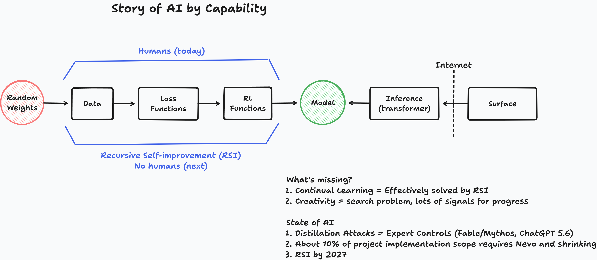

# State of AI

## Introduction

If you look for a consensus on where AI is headed, you won't find one. Yann LeCun, one of the people who built the field, argues that large language models are a dead end and that real intelligence will need a different architecture. Meanwhile the frontier labs are [wagering tens of billions of dollars on the opposite bet](https://x.com/dwarkesh_sp/status/2070551894674555081): that scaling carries today's models more or less straight to artificial general intelligence. These claims flatly contradict each other, and the people making them are neither foolish nor looking at different evidence.

When serious people look at the same data and reach opposite conclusions, the disagreement is usually not about the data. It is about the lens. The view you take determines what you can see, and choosing the view is the real intellectual act. Einstein did not out-measure his contemporaries; he imagined riding alongside a beam of light and saw an old problem from a vantage no instrument could have given him. Most of the loud disagreement about AI comes from a choice of lens that almost nobody states out loud.

So this piece is both a forecast and an argument about how to forecast. I lay out the three lenses people actually use, say which one I think is right and why, and then show what it predicts. The predictions come first, in short form. The reasoning is the rest of the essay, because the reasoning is the part worth criticizing.

## Table of Contents

1. [The Short Version](#1-the-short-version)
2. [Why Some Forecasters Are Right](#2-why-some-forecasters-are-right)
3. [Three Lenses for Looking at AI](#3-three-lenses-for-looking-at-ai)
4. [What the Information Lens Predicts](#4-what-the-information-lens-predicts)
5. [Where the Work Goes: Hands, Heads, Hearts](#5-where-the-work-goes-hands-heads-hearts)
- [Conclusion](#conclusion)
- [Further Reading](#further-reading)

## 1. The Short Version

For those who had to drop early, here is what I think the right lens implies, stated baldly so you can argue with it:

- **Recursive self-improvement (RSI)**, a system getting measurably better at the work of improving itself, is plausibly within reach around **2027**.
- RSI is what makes **continual learning** practical: models that keep updating from their own experience in deployment, rather than being trained once and frozen.
- **Creativity** follows shortly after. I don't think creativity is a particularly hard algorithm. I think it is a search problem: evolution stumbled into it, and we have abundant data of humans doing it. With continued data scaling and feedback from millions of users, I expect it to emerge in models, not as a separate miracle.
- Human work moves outward in stages: from **Hands** (physical and agricultural labor) to **Heads** (knowledge work) to **Hearts** (social, relational, and care work). We are living through the automation of Heads right now.

If you take one thing away, take the lens argument, not the dates. The dates are the part most likely to be wrong. The lens, if it is right, will stay useful long after any particular date has passed.

## 2. Why Some Forecasters Are Right

Before defending a lens, it's worth asking why lens choice matters so much: why some people are right about technology again and again while others, often with better credentials, are not.

I wrote about this in [The Metrics That Contain Their Causes](scm-methodology.md), and the central example there is Ray Kurzweil. Kurzweil self-reports something like an 86% accuracy rate on his technology predictions. Whether or not that number survives scrutiny, he was right about the long-run trajectory of computing for decades while often missing the specific inventions. How can anyone be that right about the direction and that wrong about the particulars?

The answer is that Kurzweil was not doing empiricism, even though it looks like he was. He found what I call a **Success Compression Metric**: a single variable whose rise certifies that a whole hidden economy of prerequisite problems has already been solved. His variable was compute per dollar. When compute rises, you know energy was generated, chips were fabricated at nanometer scale, capital was allocated, demand existed, and institutions held together well enough to keep it all running. The number is a certificate, not just a measurement.

The data can show that compute *has* risen. It can never show that it *will* rise. "Compute keeps rising" is a conjecture that projects a future the data cannot contain. And the real predictive work came before any of that: the decision to watch compute rather than transistor counts, patent filings, or research headcount. That choice was a conjecture about which variable contains the causes. The numbers could not have made it, because the numbers don't tell you which of them to read.

Forecasters who are repeatedly right are not better at staring at data. They are better at choosing the variable, and that choice is theoretical, not empirical. The disagreement about AI is, at bottom, a disagreement about which lens to choose.

## 3. Three Lenses for Looking at AI

Three lenses are in wide use. They are rarely named, which is why the arguments built on them talk past each other.

**The data-tells-the-story lens.** This is the empiricist's default, and it sounds the most rigorous: look at what the systems do, benchmark them, extrapolate the curves, and trust that the data, read honestly, tells you where things are going. Its hidden weakness is the one Kurzweil's case exposed. Data can tell you what happened under certain conditions. It cannot tell you what *will* happen, and it cannot tell you what is *possible* but hasn't happened yet. This is a central lesson of Karl Popper's philosophy of science, set out in [*Conjectures and Refutations*](https://www.amazon.com/Conjectures-Refutations-Scientific-Knowledge-Routledge/dp/0415285941) (1963): observation tests theories; it does not generate or certify them. Imre Lakatos showed the same logic at work in mathematics in [*Proofs and Refutations*](https://www.amazon.com/Proofs-Refutations-Mathematical-Discovery-Philosophy/dp/1107534054), where even proofs advance by conjecture and criticism rather than by piling up certainty. An empiricist reading AI benchmarks is already conjecturing, without noticing, about which benchmarks matter and which trends will continue. The lens hides its theory behind the appearance of just looking.

**The neuroscience lens.** When direct data on a future capability is missing, most academics reach for the brain as the reference model. Demis Hassabis, who took a PhD in cognitive neuroscience before founding DeepMind, is the clearest example. The implicit argument is that the brain is the one general intelligence we have, so the path to building one runs through understanding it. This lens is also usually treated as empirical. Its weakness is that it is **substrate-dependent**. Brains are organs shaped by evolution for biological concerns: staying alive, reproducing, navigating an ancestral environment. Treating their architecture as the template for intelligence in general assumes that intelligence must resemble the one accidental implementation we happen to have. That is a strong assumption, and it is rarely defended as one.

**The information lens.** This is the one I think is right. It is not yet the common view, though it is gaining ground. It treats intelligence as a matter of *information*, of what operations a system performs on information, rather than of the substrate that performs them. The right question about a capability is then never "does this work the way a brain works?" but "what information process does this capability require, and can that process run on any universal substrate?" Blaise Agüera y Arcas makes this case directly in [*What Is Intelligence?*](https://mitpress.mit.edu/9780262049955/what-is-intelligence/). The same lens is doing serious work elsewhere: age reversal research increasingly treats aging as a loss of information rather than mere physical wear, under the [Information Theory of Aging](https://x.com/davidasinclair/status/2065477182798057606). When one lens starts paying off in unrelated fields, that is weak but real evidence it is carving reality closer to its joints.

The three lenses are not equally informative about the future. The data-tells-the-story lens can only describe what already happened. The neuroscience lens describes one implementation and tempts you to mistake it for the whole category. The information lens asks what is possible in principle for any system that processes information, so it is the only one of the three that can speak about capabilities that don't exist yet. That is why I use it.

## 4. What the Information Lens Predicts

This diagram is how I picture it. Today humans sit inside the training loop, choosing the data, loss functions, and reinforcement signals that turn random weights into a model. Recursive self-improvement is what happens when that loop closes on itself and the humans step out.

Through the information lens, the contradiction from the introduction starts to resolve. The fight between LeCun and the labs is largely a substrate argument: whether *this particular* architecture is the one. The information lens asks a different question. Not whether large language models in their current form are the final design, but whether the *information operations* intelligence requires are now being performed, in some form, on a universal substrate. If they are, the architecture is a detail that ordinary conjecture and criticism will keep refining, just as Kurzweil's approach never needed to name the winning chip design in advance.

The predictions follow from here. The lens makes them plausible; it does not prove them.

**Recursive self-improvement around 2027.** Under the information lens, RSI is not a mystical threshold that waits on a brain-like breakthrough. It is what happens when a system capable enough to contribute to its own training pipeline is pointed at that pipeline, with enough compute behind the search. The pieces (capable models, cheap search, automated experimentation) are converging, which is why a date this near is defensible. The labs no longer treat this as a thought experiment: [Anthropic](https://www.anthropic.com/institute/recursive-self-improvement) treats it as an explicit research objective, and OpenAI reports that a [recent model was already instrumental in building itself](https://www.nbcnews.com/tech/innovation/openai-says-new-codex-coding-model-helped-build-rcna257521).

In the terms of [The Metrics That Contain Their Causes](scm-methodology.md), this is an outcome forecast and so the fragile kind; the capacity underneath it is the share of the training loop that runs without humans, and that is the number I would watch.

**Continual learning.** Today's models are trained once and then frozen; they don't learn from what happens after deployment. The usual framing treats continual learning as a hard architectural problem: how to keep learning without destabilizing what the model already knows. That is a question about how information flows through a system over time, not about replicating biological memory, and RSI helps with it directly, since a system improving its own training pipeline can attack those stability problems.

But there is a simpler route I rarely see discussed, and it may matter more. Think of training as a loop with a delay. A frontier model is retrained end to end every few months, so it stays frozen for months at a stretch. RSI means the humans leave that loop, and once the loop is fully automated, it becomes something competition relentlessly optimizes. Demand for narrower, use-case-specific models adds to the pressure. Every prior wave of technology shows this arc: the first flat-screen televisions were luxuries until economies of scale ground their cost down to nothing special. I expect model training to follow it, and the loop to contract: three months, then three weeks, three days, three hours.

On this view, continual learning need not be solved as a separate capability at all. It is solved by shrinking the delay. A model that fully retrains overnight, in less time than a person spends asleep, is for every practical purpose learning continuously: it wakes having absorbed yesterday. Nor is the experience lost in between, because a model's in-context interactions in deployment are logged and flow into the next retrain. In-context learning is working memory, fast and volatile, and the retraining loop is consolidation into weights, the way sleep turns a day's experience into something lasting. "Frozen" stops being a fact about the architecture and becomes a fact about the clock, and RSI and competition are already driving the clock down.

**Creativity shortly thereafter.** This is the boldest claim, and I defend it more fully in [Computer People](computer-people.md). I think creativity is a search problem, for two reasons. Evolution, a blind search with no foresight at all, produced creativity anyway. And we have an enormous amount of data showing humans being creative, which is to say, data showing the search being run well. My hunch is that the search has a shape: problems lead to questions, questions draw on experience and priors, and solutions fall out of the space those priors carve out. On the information lens this is conjecture and criticism running over time. That is why I tie it to continual learning: a search that runs over time needs a system that keeps what it learns, so I expect creativity to follow continual learning closely rather than wait on a separate breakthrough. The feedback it needs is already there in the usage of millions of people, and continued scaling, especially of curated data, gives the search what it needs to keep improving.

None of the three predictions depends on the system resembling a brain. They depend only on certain information operations being performed continuously on a substrate capable of universal computation.

## 5. Where the Work Goes: Hands, Heads, Hearts

The capability story has an economic shadow, and it is the part most of us will feel directly. As machines absorb more kinds of work, distinctly human labor keeps moving outward in a recognizable order: from **Hands** to **Heads** to **Hearts**.

**Hands** is physical labor: the agricultural and manual work that occupied almost everyone for almost all of history. Mechanization moved most of humanity off the land and into factories and offices. In the developed world that transition is largely complete, and we rarely mourn it.

**Heads** is knowledge work: analysis, writing, coding, design, the manipulation of symbols and information. This is what we are watching get automated right now. It is disorienting because so many of us built our identities on being good at it. When the thing that made you economically valuable can be done by a system that doesn't sleep, the question of what your contribution *is* stops being abstract.

**Hearts** is social and relational work: care, social games and esports, aesthetics and art, communities, everything that is fundamentally about one being's relationship to another. This is where human attention migrates next, and the reason is simpler than the one usually offered. Humans live alongside other humans and never stop relating to one another. What changes is where our attention falls. Right now much of it is consumed by cognition, the Heads work AI is dissolving. As that lifts, the relational side of human life is not so much created as uncovered. Our hands and heads are not left idle either; they are redirected toward it. A human carries all three, and once the first two are no longer claimed by survival and cognition, the whole of us can be aimed at the highest of the three: the heart. I expect it to explode.

Look at where status and money already flow in places that were never limited by manual or cognitive scarcity. In cooperative video games and esports, the prized skill is reading and coordinating with other people in real time. Influencers' entire output is relationship at scale. The scarce, valued skill in those worlds is social skill. As manual and cognitive labor are automated, I expect relational work to become the next wave of paid labor, and beyond paid labor, the place we devote our time.

This is an economic conjecture layered on a capability conjecture, so it inherits the uncertainty of both. But it rhymes with every previous technological transition, where human work was relocated more than destroyed. The difference this time is that the machine operates on cognition itself, so the relocation is unlikely to stop at some new category of cognitive task. It runs out to the heart, where being with and for other people is the point rather than the means.

## Conclusion

The predictions form a single chain. Recursive self-improvement is the first link: once a system can improve the process that improves it, the rest follows with less friction than it looks. RSI makes continual learning practical, because an automated training loop is one competition will keep shortening until the model updates from experience instead of freezing at the end of a run. Continual learning is the condition for creativity, a search that finally runs without interruption, fed by the usage of millions of people. A system that learns continuously and creates is, on the account I develop in [Computer People](computer-people.md), a universal explainer, which is what I mean by AGI. And in a world with universal explainers in it, human work and attention move outward to the last ring: to hearts, to the relational life we were always heading toward once machines took the hands and the heads.

None of this requires a brain-like breakthrough or naming the winning architecture in advance. It requires the information lens to be the right one. Through it the chain is visible; through the other two lenses it isn't, because data only describes what has already happened and the brain is only the one implementation we happened to inherit.

I could be wrong about the dates. I probably am, somewhere. I would rather be precisely wrong from a stated lens than vaguely right from a hidden one. The chain is a conjecture. Find the link that breaks, and tell me where.

## Further Reading

For why choosing the right variable, not staring harder at data, is what made Kurzweil's forecasts work: [The Metrics That Contain Their Causes](scm-methodology.md).

For more on the information lens:

- [Computer People](computer-people.md): whether AIs can be genuinely creative, and what that implies about personhood.
- [Metaprogramming Framework To Classify Personhood](framework-of-personhood.md): what an information system must be able to do to become a person, and why it doesn't depend on substrate.
- [Living Above the Models](live-above.md): on escaping inherited human bias and holding inherited frameworks loosely.
